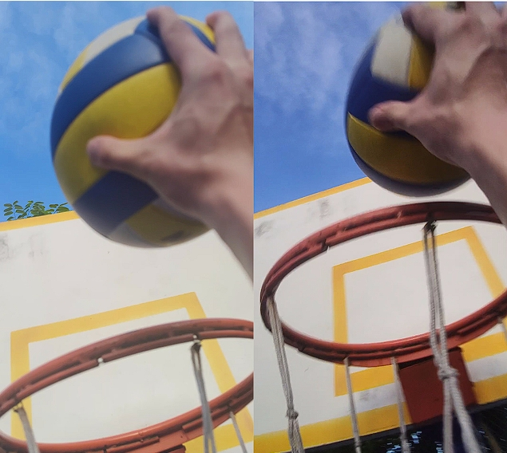

## From Hoops to Healing: A Tale of Basketball, Injuries, and Dreams

Basketball is more than just a game—it's been my companion for over a decade. This journey unfolded with the rhythm of dribbles and the swish of nets. Injuries, however, became an unexpected twist,  momentarily sidelining my dreams.

During high school, a severe [lumbar disc herniation](https://en.wikipedia.org/wiki/Spinal_disc_herniation) struck, and in my freshman year, an accidental [anterior cruciate ligament tear](https://en.wikipedia.org/wiki/Anterior_cruciate_ligament_injury) led me to surgery room.  I was rather frustrated at that time. These challenges resulted in class absences and demanded extensive time for rehabilitation. 

Unfortunately, an occasional misdiagnosis from an X-ray image further delayed my treatment. During my personal struggles, I nurtured a vision to to improve medical imaging diagnostics and rehabilitation guidance for everyone. Amid treatment and recovery, I delved into anatomy and medical imaging, discovering the role of AI in medical diagnostics. My dream is to make healthcare more intelligent and accessible.

After two years of dedicated rehabilitation, lumbar disc issues and reconstructed ACL no longer plague me. I'm back to basketball court. If you're dealing with chronic issues in the back or knees, feel free to reach out.:basketball:

    
    
    
First and third person perspective of dunk practicing in summer 2023

## Aquariums and Control Systems

As an enthusiast of underwater realms, I have cultivated a deep passion for creating and maintaining the delicate balance within an aquarium ecosystem. The aquarium, for me, is not just a glass box. It's a canvas where I orchestrate the dance of water, plants, and aquatic organisms.

One aspect that truly intrigues me is the art of controlling balance, ensuring a comfortable environment for the inhabitants. Just like a maestro conducting a symphony, I meticulously manage the nuances of water parameters  to harmonizing the growth of algae and plants, balancing the delicate interplay between temperature, carbon dioxide levels, and the array of essential nutrients. 

This fascination extends beyond the confines of my aquatic haven. In the realm of technology, I find a parallel thrill in tweaking and fine-tuning. Similar to the delicate adjustments made to control the elements in my aquarium, tweaking the parameters of a neural network model or adjust the control logic of a drone can yield exciting and rewarding results. In both realms, I find immense satisfaction in the intricate dance between inputs and outputs. 

    
The aquarium on my desk

&thinsp;

